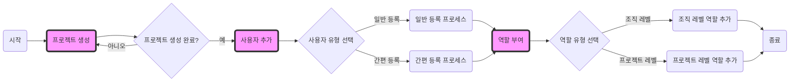

# IAM 주요 구성 요소 생성

프로젝트 생성 및 사용자 추가, 역할부여 등 초기 설정을 해보는 실습입니다.

## 1. 프로젝트 생성

1. 서비스 > Management > IAM > 프로젝트 클릭
2. 오른쪽 상단 프로젝트 생성 버튼 클릭
     - 조직 이름 : `kakaocloud-edu`
     - 프로젝트 닉네임 : `{프로젝트 별칭}`
     - 프로젝트 이름: `{프로젝트 이름}`
     - 프로젝트 설명(선택) : `참가자들에게 이론과 실습 과정을 제공하여 클라우드의 기본 개념과 카카오클라우드의 주요 서비스들에 대한 깊은 이해 제공`
3. 생성 버튼 클릭

## 2. 사용자 추가

### 2.1 사용자 등록 ( 새 사용자 등록 )

1. 서비스 > Management > IAM > 사용자
2. 사용자 등록 > 새 사용자 등록
     - 조직  : `kakaocloud-edu`
     - 사용자 ID (이메일 주소) : `kakaocloud.test@gmail.com`
          - **Note**: 가입시키려는 실제 이메일 주소로 교체하세요.
     - 이름 (선택) : `test1`
     - 닉네임 (선택) : `kakaotest1`
3. 등록 버튼 클릭

### 2.2 사용자 등록 ( 사용자 일괄 등록 )

1. 서비스 > Management > IAM > 사용자
2. 사용자 등록 > 사용자 일괄 등록
     - 조직 : `kakaocloud-edu`
     - 사용자 ID (이메일 주소) : `{사용자 이메일1}, {사용자 이메일2}`
          - **Note**: "사용자 이메일" 부분을 실제 이메일 주소들로 교체하세요.
3. 등록 버튼 클릭

## 3. 역할 부여

### 3.1 조직 레벨 역할 추가

1. 카카오 클라우드 콘솔 > 전체 서비스 > Management > IAM 접속 
2. 왼쪽 사용자 탭 클릭
3. 사용자 ID를 찾아 ID 클릭 > IAM 역할 탭 클릭 > 조직 > 역할 수정 버튼 클릭
4. 조직 역할 (선택)에서 조직 관리자 (Admin) 체크 후 오른쪽(>) 버튼 클릭
5. 수정 버튼 클릭

## 3.2 프로젝트 레벨 역할 추가

1. 카카오 클라우드 콘솔 > 전체 서비스 > Management > IAM 접속 
2. 왼쪽 사용자 탭 클릭
3. 사용자 ID를 찾아 ID 클릭 > IAM 역할 탭 클릭 > 프로젝트 > 새 역할 할당 버튼 클릭
4. 프로젝트에서 기존에 생성한 프로젝트를 선택
5. 프로젝트 역할 (선택)에서 프로젝트 관리자 (Admin) 체크 후 오른쪽(>) 버튼 클릭
6. 수정 버튼 클릭

