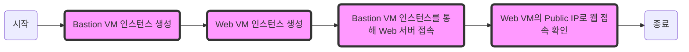

# Bastion(점프서버) 및 Web server 인스턴스 생성 실습

Bastion(점프서버) 인스턴스와 Web server 인스턴스를 생성해보고, 점프서버를 통해 웹서버로 접속해보는 실습입니다.



## 1. Bastion VM 인스턴스 생성


1. 카카오 클라우드 콘솔 > 전체 서비스 > Virtual Machine 접속
2. Instance 만들기 클릭
     - 이름 : `bastion`
     - Image : `Ubuntu 20.04 - 5.4.0-173`
     - Instance 타입 : `m2a.large`
     - Volume : `30 GB`
3. 새 Key Pair 생성 클릭
     - 이름 : `keypair`
     - 만들기 클릭
4. VPC 선택
     - VPC : `vpc_1`
     - Subnet : `main`
     - SecurityGroup 선택
5. 새 Security Group 생성 클릭
     - Security Group 이름: `bastion`
     - Inbound :
       - 프로토콜: `TCP` 
       - 패킷 출발지: `{사용자 IP}/32`
          - **Note**: "사용자_IP" 부분을 실제 IP 주소로 교체하세요.
               - 사용자 IP 조회: [https://www.myip.com/](https://www.myip.com/)
          - 실습 환경에 따라 사용자의 IP가 변경될 가능성이 있다면 `0.0.0.0/0` 으로 설정 
       - 포트 번호: `22` 
6. Outbound 클릭
     - Outbound
          - 프로토콜 : `ALL` 
          - 패킷 목적지 : `0.0.0.0/0`
     - 만들기 버튼 클릭
7. 고급설정 버튼 클릭
     - 사용자 스크립트에 아래 내용 붙여넣기 (mysql client 사용을 위함)
       
     #### **lab4-1-7**
     ```bash
     #!/bin/bash
     sudo apt-get update
     sudo apt-get install -y mysql-client
     
     ```

     - **Note**: 고급 설정 스크립트 부분을 못하더라도 추후 설정할 수 있습니다. VM 접속 후 위 내용 붙여넣기

8. 만들기 버튼 클릭
9. Virtual Machine > Instance
10. 생성된 인스턴스의 우측 메뉴바 > Public IP 연결 클릭
    - `새로운 Public IP를 생성하고 자동으로 할당` 
11. 확인 버튼 클릭
12. 생성된 인스턴스의 우측 메뉴바 > SSH 연결 클릭
     - SSH 접속 명령어 복사(다운받은 keypair.pem 파일이 있는 경로에서 아래 명령어를 실행합니다.)
     - 터미널 열기
       keypair를 다운받아놓은 폴더로 이동
     - 터미널에 명령어 붙여넣기
     - yes 입력

     #### **lab4-1-12-1**
     ```bash
     cd {keypair.pem 다운로드 위치}
     ```
     - 리눅스의 경우에 아래와 같이 키페어의 권한을 조정

     #### **lab4-1-12-2**
     ```bash
     chmod 400 keypair.pem
     ```

     #### **lab4-1-12-3**
     ```bash
     icacls.exe keypair.pem /reset
     icacls.exe keypair.pem /grant:r %username%:(R)
     icacls.exe keypair.pem /inheritance:r
     ```
     - 윈도우에서 ssh 접근이 안될 경우에 cmd 창에서 keypair.pem가 있는 경로로 이동 후 위 명령어 입력
     

     #### **lab4-1-12-4**
     ```bash
     ssh -i keypair.pem ubuntu@{bastion의 public ip주소}
     ```
     - **Note**: "bastion의 public ip주소" 부분을 복사한 IP 주소로 교체하세요.
   
     #### **lab4-1-12-5**
     ```bash
     yes
     ```

## 2. Web VM 인스턴스 생성

1. 카카오 클라우드 콘솔 > 전체 서비스 > Virtual Machine 접속
     - bastion 인스턴스의 Private IP 복사
2. Instance 만들기 버튼 클릭
     - 이름 : `web_server_1`
     - Image : `Ubuntu 20.04 - 5.4.0-173`
     - Instance 타입 : `m2a.large`
     - Volume : `30 GB`
     - Key Pair : `keypair`
3. VPC 선택
     - VPC : `vpc_1`
     - Subnet : `main`
     - 새 Security Group 생성
4. SecurityGroup 만들기
     - Security Group 이름 : `webserver`
     - Inbound 
          - 프로토콜: `TCP`, 패킷 출발지: `0.0.0.0/0`, 포트번호: `80` 
          - 프로토콜: `TCP`, 패킷 출발지: `0.0.0.0/0`, 포트번호: `443`
          - 프로토콜: `TCP`, 패킷 출발지: `{bastion Private IP}/32`, 포트번호: `22` 
               - **Note**: "bastion Private IP" 부분을 복사한 IP 주소로 교체하세요.
          - 프로토콜: `ICMP`, 패킷 출발지: `0.0.0.0/0`
5. Outbound 클릭
     - Outbound
          - 프로토콜 : `ALL` 
          - 패킷 목적지 : `0.0.0.0/0`
6. 만들기 버튼 클릭
7. 고급설정 버튼 클릭
8. 사용자 스크립트에 아래 명령어 붙여넣기

     #### **lab4-2-8**
     ```bash
     #!/bin/bash        
     sudo apt-get update
     sudo apt-get -y remove mariadb-server mariadb-client
     sudo apt-get -y install apache2 php mysql-client php-mysql wget
     sudo systemctl enable apache2
     cd /var/www/html
     sudo rm -f index.html
     wget https://github.com/kimjaehyeon0314/test/raw/main/kakao.tar.gz -O kakao.tar.gz
     tar -xvf kakao.tar.gz
     sudo mv kakao/{index.php,get_user_list.php,add_user.php} /var/www/html/
     sudo systemctl restart apache2
     ```
     - **Note**: 첫번째 '#!/bin/bash'도 적어 주셔야 합니다.
     - **Note**: 스크립트 설정을 못하더라도 추후 설정 가능합니다.
     - 멀티스레딩: 활성화
     
9. 만들기 버튼 클릭
10. Virtual Machine > Instance > 생성한 인스턴스 ( web_server_1 )의 우측 메뉴바 클릭 > Public IP 연결 클릭
     - `새로운 Public IP를 자동으로 할당` 선택
11. 확인 버튼 클릭


## 3. Bastion VM 인스턴스를 통해 Web 서버 접속

1. 카카오 클라우드 콘솔 > 전체 서비스 > Virtual Machine 접속
2. Virtual Machine > Instance 
3. Bastion VM과  Web Server의 IP 확인하기
     - Bastion의 `Public IP 주소` 확인 및 복사
     - Web_server_1의 `Private IP 주소` 확인 및 복사
4. 터미널 명령어 입력
     - keypair를 다운받아놓은 폴더로 이동
     - 명령어 붙여넣기
     - yes  입력
  
     #### **lab4-3-4-1**
     ```bash
     cd {keypair.pem 다운로드 위치}
     ```
     - **Note**: "{keypair.pem 다운로드 위치}" 부분을 keypair.pem의 디렉터리 위치로 교체하세요.

     #### **lab4-3-4-2**
     ```bash
     ssh -i "keypair.pem" -o ProxyCommand="ssh -W %h:%p ubuntu@{bastion의 public IP} -i keypair.pem" ubuntu@{web_server_1의 private IP}
     ```
     - **Note**: "{Bastion의 public IP}", "{web_server_1의 private IP}" 부분을 복사한 IP 주소로 교체하세요.

     #### **lab4-3-4-3**
     ```bash
     yes
     ```

## 4. Web VM의 Public IP로 웹 접속 확인


1. 카카오 클라우드 콘솔 > 전체 서비스 > Virtual Machine 접속
2. Virtual Machine > Instance 
3. web_server_1 인스턴스 확인하기
     - web_server_1의 `Public IP 주소` 확인 및 복사
4. web_server_1의 `Public IP 주소` 브라우저 창에 입력
     - 생성 지연으로 인해 시간이 조금 지나면 연결이 됩니다.
