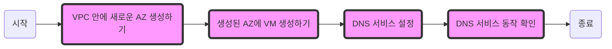

# Multi-AZ 구성 및 DNS 실습

VPC안에 기존에 사용하던 AZ1과 다른 AZ2를 사용할 수 있도록 설정합니다. AZ2 안에 새로운 VM 인스턴스를 생성하고 DNS 연결을 통해 AZ1의 웹서버와 새로 생성한 VM에 연결합니다. 연결한 도메인을 통해 DNS 서비스가 작동하는지 확인하는 실습입니다.




## 1. VPC 안 다른 AZ 생성하기


1. 카카오 클라우드 콘솔 > 전체 서비스 > VPC 접속
2. 좌측 Subnet 클릭
3. Subnet 만들기 클릭
     - VPC 선택 : `vpc_1`
     - Subnet 이름 : `main-b`
     - Availability Zone: `kr-central-2-b`
     - IPv4 CIDR 블록: `172.30.32.0/20`
4. 만들기 클릭

## 2. VPC 안 다른 AZ에 VM생성하기


1. 카카오 클라우드 콘솔 > 전체 서비스 > Virtual Machine > Instance
2. 인스턴스 만들기 클릭
     - 이름 : `vm_5`
     - Image : `Ubuntu 20.04 - 5.4.0-173`
     - Instance 타입 : `m2a.large`
     - Volume : `30 GB`
     - Key Pair : `keypair`
     - VPC : `vpc_1`
     - Subnet : `main-b(kr-cenrtral2-b의 Public 서브넷)`
3. 새 Security Group 생성 클릭
     - Security Group 이름 : `vm_5`
     - Inbound 
          - 프로토콜: TCP, 패킷 출발지: `0.0.0.0/0`, 포트번호: `22` 
          - 프로토콜: TCP, 패킷 출발지: `0.0.0.0/0`, 포트번호: `80`
     - Outbound 
          - 프로토콜: `ALL`
          - 패킷 목적지: `0.0.0.0/0`
4. 고급설정 버튼 클릭
     - 사용자 스크립트에 아래 내용 붙여넣기
     #### **lab7-2-4**
     ```bash
     #!/bin/bash
     sudo apt update -y
    sudo apt install -y apache2
    sudo systemctl start apache2
    sudo systemctl enable apache2
     ```
5. 만들기 버튼 클릭
6. 카카오 클라우드 콘솔 > 전체 서비스 > Virtual Machine > Instance
7. 생성된 vm_5 인스턴스의 우측 메뉴바 클릭 > Public IP 연결 클릭
     - `새로운 Public IP를 자동으로 할당` 선택
8. 확인 버튼 클릭
9. vm_5의 Public IP 복사
10. 브라우저창에 입력
11. apache 웹서버 Test페이지가 나오는 것을 확인

## 3. DNS 서비스 설정


1. 카카오 클라우드 콘솔 > 전체 서비스 > DNS 접속
2. DNS Zone 만들기 버튼 클릭
     - DNS Zone 이름 : `kakaocloud-edu.com`
3. 만들기 버튼 클릭
4. 생성된 `kakaocloud-edu.com` DNS 클릭
5. 레코드 추가 버튼 클릭
     - 레코드 타입 : `A`
     - TTL : `60`
     - 값 : `{연결하려는 VM의 Public IP}`
     - **Note**: "{연결하려는 VM의 Public IP}" 부분을 실제 IP 주소로 교체하세요.
     _**note**: 본 실습에서는 kr-central-2-a에 위치한 Load Balancer와  kr-central-2-b에 위치한 vm_5를 연결함
6. 추가 버튼 클릭
7. 추가 설정
     - 사용 도메인의 네임서버를 카카오클라우드의 네임서버로 바꿔주어야함
     - 도메인 구입처의 도메인 설정창에서 네임서버를 변경 
     - 본 실습에서는 ‘가비아’ 라는 도메인 제공 서비스를 이용하였음

## 4. DNS 서비스 동작 확인


1. 브라우저에 `kakaocloud-edu.com` (연결한 도메인)을 입력

### 3.1 kr-central-2-a에 있는 Load Balancer에 연결된 경우


2. 호스트명 확인하기
     - Load Balancer는 webserver1과 webserver2에 연결되어 있기 때문에 새로고침 시 호스트명이 연결된 VM의 IP로 바뀌는 것을 볼 수 있음
     - 새로고침 시 바로 바뀌어서 접속되지않고, 일정시간후 새로고침을 진행해야함

### 3.2 kr-central-2-b에 있는 vm_5에 연결된 경우


2. vm_5에 설치된 Apache 웹서버 테스트 페이지가 나오는 것을 확인 

