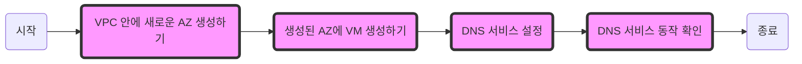

# Multi-AZ 구성 및 DNS 실습

VPC안에 기존에 사용하던 AZ1과 다른 AZ2를 사용할 수 있도록 설정합니다. AZ2 안에 새로운 VM 인스턴스를 생성하고 DNS 연결을 통해 AZ1의 웹서버와 새로 생성한 VM에 연결합니다. 연결한 도메인을 통해 DNS 서비스가 작동하는지 확인하는 실습입니다.


```mermaid
graph LR
    시작(시작) --> AZ생성(VPC 안에 새로운 AZ 생성하기)
    AZ생성 --> VM생성(생성된 AZ에 VM 생성하기)
    VM생성 --> DNS설정(DNS 서비스 설정)
    DNS설정 --> DNS동작확인(DNS 서비스 동작 확인)
    DNS동작확인 --> 종료(종료)

    %% 강조
    class AZ생성,VM생성,DNS설정,DNS동작확인 emphasized;
    
    %% 클래스 스타일
    classDef emphasized fill:#f9f,stroke:#333,stroke-width:4px;
```


## 1. VPC 안 다른 AZ 생성하기


1. 카카오 클라우드 콘솔 > 전체 서비스 > VPC 접속
2. 좌측 Subnet 클릭
3. Subnet 만들기 클릭
     - VPC 선택 : `vpc_1`
     - Subnet 이름 : `vpc_1_public_sn2`
     - Availability Zone: `kr-central-2-b`
     - IPv4 CIDR 블록: `172.30.32.0/20`
4. 만들기 클릭

## 2. VPC 안 다른 AZ에 VM생성하기


1. 카카오 클라우드 콘솔 > 전체 서비스 > Virtual Machine > Instance
2. 인스턴스 만들기 클릭
     - 이름 : `web_server_3`
     - Image : `Ubuntu 20.04`
     - Instance 타입 : `m2a.large`
     - Volume : `30 GB`
     - Key Pair : `keypair`
     - VPC : `vpc_1`
     - Subnet : `vpc_1_public_sn2`
3. Security Group 선택
     - Security Group 이름 : `webserver`
4. 새 인터페이스 클릭
     - IP 할당 방식: `자동` 
5. 고급설정 버튼 클릭
     - 사용자 스크립트에 아래 내용 붙여넣기
     #### **lab7-2-4**
     ```bash
     #!/bin/bash        
     sudo apt-get update
     sudo apt-get -y remove mariadb-server mariadb-client
     sudo apt-get -y install apache2 php mysql-client php-mysql wget
     sudo systemctl enable apache2
     cd /var/www/html
     sudo rm -f index.html
     wget https://github.com/kakaocloud-edu/tutorial/raw/main/EssentialBasicCourse/src/kakao.tar.gz -O kakao.tar.gz
     tar -xvf kakao.tar.gz
     sudo mv kakao/{index.php,get_user_list.php,add_user.php} /var/www/html/
     sudo systemctl restart apache2
     ```
6. 생성 버튼 클릭
7. 카카오 클라우드 콘솔 > 전체 서비스 > Virtual Machine > Instance
8. 생성된 web_server_3 인스턴스의 우측 메뉴바 클릭 > Public IP 연결 클릭
     - `새로운 Public IP를 자동으로 할당` 선택
9. 확인 버튼 클릭
10. web_server_3의 Public IP 복사
11. 브라우저창에 입력
12. apache 웹서버 Test페이지가 나오는 것을 확인

## 3. Load Balancer 생성 및 설정

1. 카카오 클라우드 콘솔 > 전체 서비스 > Load Balancing
2. Load Balancer 만들기 버튼 클릭
     - 타입 선택 : `Application Load Balancer`
     - Load Balancer 이름 : `App_LB_b`
     - VPC : `vpc_1`
     - Subnet : `vpc_1_public_sn2`
     - Listener : `HTTP` : `80`
3. 만들기 버튼 클릭
4. 카카오 클라우드 콘솔 > 전체 서비스 > Load Balancing
5. Target Group 클릭
6. Target Group 만들기 버튼 클릭
     - Availability Zone : `kr-central-2-a`
     - Load Balancer : `App_LB_B`
     - Listener : `HTTP : 80`
     - Target Group 이름 : `App_Target_B`
     - 프로토콜 : `HTTP`
     - 알고리즘 : `Round Robin`
     - Sticky Session : `미사용`
     - Health Check : `사용`
     - 타입 : `HTTP`
7. 다음 버튼 클릭
8. 체크 박스 선택
     - web_server_3(Instance) 좌측 체크 박스 선택
9. 트래픽 포트:`80`
10. Target 추가 버튼 클릭
11. 다음 버튼 클릭
12. 생성 버튼 클릭
13. 카카오 클라우드 콘솔 > 전체 서비스 > Load Balancing
14. App_LB_B 우측 메뉴바 아이콘 클릭
15. Public IP 연결 버튼 클릭
     - `새로운 Public IP를 생성하고 자동으로 할당` 선택
16. 적용 버튼 클릭
17. 카카오 클라우드 콘솔 > 전체 서비스 > Virtual Machine > Instance
18. App_LB_B의 퍼블릭 IP로 정상 접근 확인

## 4. DNS 서비스 설정


1. 카카오 클라우드 콘솔 > 전체 서비스 > DNS 접속
2. DNS Zone 만들기 버튼 클릭
     - DNS Zone 이름 : `kakaocloud-edu.com`
3. 만들기 버튼 클릭
4. 생성된 `kakaocloud-edu.com` DNS 클릭
5. 레코드 추가 버튼 클릭
     - 레코드 타입 : `A`
     - TTL : `60`
     - 값 : `{연결하려는 VM의 Public IP}`
     - **Note**: "{연결하려는 VM의 Public IP}" 부분을 실제 IP 주소로 교체하세요.
     _**note**: 본 실습에서는 kr-central-2-a에 위치한 Load Balancer와  kr-central-2-b에 위치한 vm_5를 연결함
6. 추가 버튼 클릭
7. 추가 설정
     - 사용 도메인의 네임서버를 카카오클라우드의 네임서버로 바꿔주어야함
     - 도메인 구입처의 도메인 설정창에서 네임서버를 변경 
     - 본 실습에서는 ‘가비아’ 라는 도메인 제공 서비스를 이용하였음

## 5. DNS 서비스 동작 확인


1. 브라우저에 `kakaocloud-edu.com` (연결한 도메인)을 입력

### 3.1 kr-central-2-a에 있는 Load Balancer에 연결된 경우


2. 호스트명 확인하기
     - Load Balancer는 webserver1과 webserver2에 연결되어 있기 때문에 새로고침 시 호스트명이 연결된 VM의 IP로 바뀌는 것을 볼 수 있음
     - 새로고침 시 바로 바뀌어서 접속되지않고, 일정시간후 새로고침을 진행해야함

### 3.2 kr-central-2-b에 있는 vm_5에 연결된 경우


2. vm_5에 설치된 Apache 웹서버 테스트 페이지가 나오는 것을 확인 

