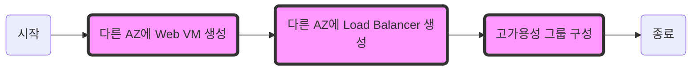

# 고가용성 그룹 구성 실습

기존 AZ1에 구성한 로드밸런서의 안정성을 향상시키기 위하여 AZ2에 웹 서버, 로드밸런서를 구성하고, 고가용성 그룹을 통해 로드 밸런서를 이중화하는 실습입니다.


```mermaid
graph LR
    시작(시작) --> VM생성(다른 AZ에 Web VM 생성)
    VM생성 --> LB생성(다른 AZ에 Load Balancer 생성)
    LB생성 --> HA그룹구성(고가용성 그룹 구성)
    HA그룹구성 --> 종료(종료)

    %% 강조
    class VM생성,LB생성,HA그룹구성 emphasized;

    %% 클래스 스타일
    classDef emphasized fill:#f9f,stroke:#333,stroke-width:4px;
```

> **Note**: 본 Lab은 [Lab03(VPC 생성)](https://github.com/kakaocloud-edu/tutorial/blob/main/EssentialBasicCourse/PracticalTextbook/Lab03.md)에서 `kr-central-2-a`, `kr-central-2-b` 두 개 가용영역에 걸쳐 생성해 둔 서브넷(`vpc_1_public_sn2` 등)을 그대로 사용합니다. 별도로 새 AZ/서브넷을 생성하는 과정은 없습니다.

## 1. 다른 AZ에 Web VM 생성

1. 카카오 클라우드 콘솔 > 전체 서비스 > Virtual Machine > Instance
2. 인스턴스 생성 클릭
     - 이름 : `web_server_3`
     - Image : `Ubuntu 20.04`
     - Instance 타입 : `m2a.xlarge`
     - Volume : `30 GB`
     - Key Pair : `keypair`
     - VPC : `vpc_1`
     - Subnet : `vpc_1_public_sn2`
3. Security Group 선택
     - Security Group 이름 : `webserver`
4. 새 인터페이스 클릭
     - IP 할당 방식 : `자동`
5. 고급설정 버튼 클릭
     - 사용자 스크립트에 아래 내용 붙여넣기

     #### **lab7-1-5**
     ```bash
     #!/bin/bash
     sudo apt-get update
     sudo apt-get -y remove mariadb-server mariadb-client
     sudo apt-get -y install apache2 php mysql-client php-mysql wget
     sudo systemctl enable apache2
     cd /var/www/html
     sudo rm -f index.html
     wget https://github.com/kakaocloud-edu/tutorial/raw/main/EssentialBasicCourse/src/kakao.tar.gz -O kakao.tar.gz
     tar -xvf kakao.tar.gz
     sudo mv kakao/{index.php,get_user_list.php,add_user.php} /var/www/html/
     sudo systemctl restart apache2
     ```

6. 생성 버튼 클릭
7. 카카오 클라우드 콘솔 > 전체 서비스 > Virtual Machine > Instance
8. 생성된 web_server_3 인스턴스의 우측 메뉴바 클릭 > Public IP 연결 클릭
     - `새로운 Public IP를 자동으로 할당` 선택
9. 확인 버튼 클릭
10. web_server_3의 Public IP 복사
11. 브라우저창에 입력하여 apache 웹서버 Test 페이지가 나오는 것을 확인
12. 카카오 클라우드 콘솔 > 전체 서비스 > MySQL > database 클릭
     - 엔드포인트 URL 복사
13. web_server_3 웹페이지 호스트 입력 칸에 엔드포인트 URL 붙여넣기
     - 유저 이름 가져오기 버튼 클릭
     - kakao, cloud, edu가 조회되는지 확인 (DB 연결 확인)

## 2. 다른 AZ에 Load Balancer 생성

1. 카카오 클라우드 콘솔 > 전체 서비스 > Load Balancing
2. Load Balancer 만들기 버튼 클릭
     - 타입 선택 : `Application Load Balancer`
     - Load Balancer 이름 : `App_LB_B`
     - VPC : `vpc_1`
     - Subnet : `vpc_1_public_sn2`
     - Listener : `HTTP` : `80`
3. 만들기 버튼 클릭
4. 카카오 클라우드 콘솔 > 전체 서비스 > Load Balancing
5. Target Group 클릭
6. Target Group 만들기 버튼 클릭
     - Availability Zone : `kr-central-2-b`
     - Load Balancer : `App_LB_B`
     - Listener : `HTTP : 80`
     - Target Group 이름 : `App_Target_B`
     - 프로토콜 : `HTTP`
     - 알고리즘 : `Round Robin`
     - Sticky Session : `미사용`
     - Health Check : `사용`
     - 타입 : `HTTP`
7. 다음 버튼 클릭
8. 체크 박스 선택
     - web_server_3(Instance) 좌측 체크 박스 선택
9. 트래픽 포트 : `80`
10. Target 추가 버튼 클릭
11. 다음 버튼 클릭
12. 생성 버튼 클릭
13. 카카오 클라우드 콘솔 > 전체 서비스 > Load Balancing
14. App_LB_B 우측 메뉴바 아이콘 클릭
15. Public IP 연결 버튼 클릭
     - `새로운 Public IP를 생성하고 자동으로 할당` 선택
16. 적용 버튼 클릭
17. 카카오 클라우드 콘솔 > 전체 서비스 > Virtual Machine > Instance
18. App_LB_B의 퍼블릭 IP로 정상 접근 확인
19. web_server_3의 우측 메뉴바 클릭 > Public IP 연결 해제 클릭

## 3. 고가용성 그룹 구성

1. 카카오 클라우드 콘솔 > 전체 서비스 > Load Balancing > 고가용성 그룹
2. 고가용성 그룹 생성 버튼 클릭
     - Application Load Balancer 선택
     - 체계 : `인터넷 경계`
3. 고가용성 그룹 정보 등록
     - 고가용성 그룹 이름 : `App_HA`
     - 서브넷 - LB 노드
          - `vpc_1_public_sn1` → `App_LB_A`
          - `vpc_1_public_sn2` → `App_LB_B`
4. 생성 버튼 클릭
5. App_HA 고가용성 그룹의 DNS 이름 복사
6. 웹 브라우저에 붙여넣어 접속 확인
     - **Note**: 카카오클라우드가 자동 발급하는 DNS 이름으로 접속하므로, 별도의 사용자 도메인·네임서버 설정은 필요하지 않습니다.
