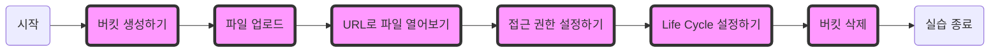

# 카카오 클라우드 Console을 활용한 Object Storage 실습

새로운 File Storage 인스턴스를 생성합니다. File Storage를 사용중인 VM인스턴스와 연결해보고, 연결이 되었는지 확인해봅니다. 연결된 File Storage를 마운트 해제 후 확인해봅니다.

**[아래 시작 전에 다음 실습 미리 준비하기](https://github.com/kakaocloud-edu/tutorial/blob/main/EssentialBasicCourse/PracticalTextbook/Lab11.md#lab11-2-1)**

## 1. 버킷 생성하기

1. 카카오 클라우드 콘솔 > 전체 서비스 > Object Storage 접속
2. 버킷만들기 버튼 클릭
     - 이름 : `bucket1`
3. 만들기 버튼 클릭

## 2. 파일업로드

1. 카카오 클라우드 콘솔 > 전체 서비스 > Object Storage 접속
2. bucket1 버킷 클릭
3. 폴더 생성 버튼 클릭
     - 폴더이름: `pic`
4. 생성 버튼 클릭
5. 파일 업로드 버튼 클릭
6. 파일 추가 버튼 클릭 해 업로드 할 파일 추가
7. 업로드 버튼 클릭

## 3. 파일 정보 URL로 브라우저에서 파일 열어보기

1. 카카오 클라우드 콘솔 > 전체 서비스 > Object Storage 접속
2. bucket1 버킷 클릭
3. 업로드 한 파일 우측 메뉴바 클릭 > 파일 정보 버튼 클릭
4. URL 복사 버튼 클릭
5. 저장 버튼 클릭
6. 브라우저에 복사한 URL 입력 
7. 오류 발생 - 접근 권한 에러

## 4. 접근 권한 설정하기

1. 카카오 클라우드 콘솔 > 전체 서비스 > Object Storage 접속
2. bucket1 버킷 클릭
3. 권한 버튼 클릭
4. 접근 버튼 클릭
5. 접근 설정 버튼 클릭
     - `퍼블릭 액세스 허용` 선택
6. 저장 버튼 클릭
7. 확인 버튼 클릭
8. 브라우저에 복사한 URL 입력

## 5. Life Cycle 설정하기

1. 카카오 클라우드 콘솔 > 전체 서비스 > Object Storage 접속 
2. bucket1 버킷 클릭
3. 우측 메뉴바 클릭 > Life Cycle 설정 버튼 클릭
     - 대상객체: `전체 객체` 선택
     - 유지기간: `30`
4. 정책 적용 버튼 클릭
5. 닫기 버튼 클릭

## 6. 버킷 삭제

1. 카카오 클라우드 콘솔 > 전체 서비스 > Object Storage 접속
2. bucket1 버킷의 우측 메뉴바 클릭 > 버킷 삭제 버튼 클릭
3. 버킷에 객체가 존재해 실패
4. bucket1 클릭
5. 객체 클릭
6. 객체 내 존재하는 파일의 우측 메뉴바 클릭 > 삭제 버튼 클릭
7. 삭제 버튼 클릭
8. bucket1 우측 메뉴바 클릭 > 버킷 삭제 버튼 클릭
     - `bucket1` 입력
9. 삭제 버튼 클릭
