# API를 활용한 Object Storage 실습

카카오 클라우드에서 제공하는 여러 API를 활용하여 Object Storage를 VM인스턴스 환경에서 활용해봅니다. AWS S3 Client를 활용해 CLI 환경에서 API 인증키를 발급받고 버킷 생성 및 상세 내용 조회, 파일관리 등 Object Storage를 활용할 수 있는 방법에 대한 실습입니다.

```mermaid
graph LR
    시작(시작) --> VM접속(VM인스턴스 SSH 접속)
    VM접속 --> 실습환경준비(실습 환경 준비)
    실습환경준비 --> 버킷생성및조회(버킷 생성 및 조회)
    버킷생성및조회 --> 버킷내폴더생성(버킷 내 폴더 생성)
    버킷내폴더생성 --> 버킷폴더내파일생성(버킷 폴더 내 파일 생성)
    버킷폴더내파일생성 --> 파일내용확인(파일 내용 확인)
    파일내용확인 --> 리소스삭제(리소스 삭제)
    리소스삭제 --> 종료(실습 종료)

    %% 강조
    class VM접속,실습환경준비,버킷생성및조회,버킷내폴더생성,버킷폴더내파일생성,파일내용확인,리소스삭제 emphasized;
    
    %% 클래스 스타일
    classDef emphasized fill:#f9f,stroke:#333,stroke-width:4px;
```



## 1. VM인스턴스 SSH 접속


1. 카카오 클라우드 콘솔 > 전체 서비스 > Virual Machine 접속
2. `bastion` 인스턴스의 우측 메뉴바 클릭 > SSH 연결 버튼 클릭
     - SSH 접속 명령어 복사(6. keypair.pem 파일이 있는 경로에서 아래 명령어를 실행합니다.)
       keypair를 다운받아놓은 Downloads 폴더로 이동
     - 터미널 열기
     - 터미널에 명령어 붙여넣기

    #### **lab11-1-2-1**
    ```bash
    cd {keypair.pem 다운로드 위치}
    ```

    #### **lab11-1-2-2**
    ```bash
    ssh -i keypair.pem ubuntu@{ip주소}
    ```

## 2. 실습 환경 준비


1. 실습을 위한 패키지 설치 - 터미널 명령어 입력

    #### **lab11-2-1**
    ```bash
    sudo apt install -y software-properties-common unzip
    sudo apt install -y jq
    curl "https://awscli.amazonaws.com/awscli-exe-linux-x86_64.zip" -o "awscliv2.zip"
    unzip awscliv2.zip
    sudo ./aws/install
    ```
    - kakaocloud의 Object Storage는 AWS S3 API와 호환됨


2. 환경변수 셋팅 - env.sh 파일 생성 - 터미널 명령어 입력
    - 아래 스크립트(**lab11-2-2**)를 메모장에 복사하여 {KAKAO_ACCESS_KEY}, {KAKAO_ACCESS_SECRET_KEY}, {USER_ID} 를 수정후 터미널에 입력
         - **Note**: {KAKAO_ACCESS_KEY} 값을 액세스 키 ID(Lab1 참고)로 수정
         - **Note**: {KAKAO_ACCESS_SECRET_KEY} 값을 액세스 보안키(Lab1 참고)로 수정
         - **Note**: {USER_ID} 값을 사용자 ID 값으로 수정
              - 사용자 ID 얻는 방법: 콘솔 화면의 우측 상단 사용자 아이콘 클릭 > 계정 정보 > 비밀번호 입력 > **사용자 고유 ID** 복사
                
                
                

                


    #### **lab11-2-2**
    - 아래 스크립트를 통해 kakaocloud의 IAM 서비스와 상호작용하여 AWS S3 호환 API를 사용할 수 있는 자격 증명(AWS_ACCESS_KEY_ID 및 AWS_SECRET_ACCESS_KEY)을 자동으로 생성하고, kakaocloud 오브젝트 스토리지에 연결할 수 있도록 준비함
       - 환경 변수 설정: ACCESS_KEY, ACCESS_SECRET_KEY, USER_ID, AWS_DEFAULT_REGION, AWS_ENDPOINT_URL 등의 환경 변수를 설정
       - 인증 토큰 발급: curl 명령어를 사용해 Kakao Cloud IAM 서비스에 POST 요청을 보내, ACCESS_KEY와 ACCESS_SECRET_KEY를 이용해 인증 토큰을 발급 -> 인증 토큰은 X-Subject-Token 헤더로 반환되며, 이 토큰은 이후 요청에서 인증에 사용
       - 자격 증명 조회: 프로젝트 ID와 사용자 ID를 이용해 IAM 서비스로부터 EC2 호환 자격 증명(AWS S3 호환 API에서 사용할 자격 증명)을 조회 -> 이 자격 증명은 AWS_ACCESS_KEY_ID와 AWS_SECRET_ACCESS_KEY로 반환됨
       - 모든 환경 변수는 output.txt 파일로 출력되어 저장됨
    ```bash
    cat << 'EOF' > env.sh
    export ACCESS_KEY="{KAKAO_ACCESS_KEY}"
    export ACCESS_SECRET_KEY="{KAKAO_ACCESS_SECRET_KEY}"
    export USER_ID="{USER_ID}"
    export AWS_DEFAULT_REGION="kr-central-2"
    export AWS_ENDPOINT_URL="https://objectstorage.kr-central-2.kakaocloud.com"

    export TOKEN=$(curl -s -X POST -i https://iam.kakaocloud.com/identity/v3/auth/tokens -H "Content-Type: application/json" -d \
    '{
        "auth": {
            "identity": {
                "methods": [
                    "application_credential"
                ],
                "application_credential": {
                    "id": "'${ACCESS_KEY}'",
                    "secret": "'${ACCESS_SECRET_KEY}'"
                }
            }
        }
    }' | grep -i X-Subject-Token | awk -v RS='\r\n' '{print $2}')
    if [ -z $TOKEN ]; then
            echo "TOKEN is null..."
    fi

    export PROJECT_ID=$(curl -s -X POST https://iam.kakaocloud.com/identity/v3/auth/tokens -H "Content-Type: application/json" -d \
    '{
        "auth": {
            "identity": {
                "methods": [
                    "application_credential"
                ],
                "application_credential": {
                    "id": "'${ACCESS_KEY}'",
                    "secret": "'${ACCESS_SECRET_KEY}'"
                }
            }
        }
    }' | jq -r ".token.project.id")
    if [ -z $PROJECT_ID ]; then
            echo "PROJECT_ID is null..."
    fi

    export CREDENTIALS=$(curl -s -X POST -i https://iam.kakaocloud.com/identity/v3/users/${USER_ID}/credentials/OS-EC2 \
    -H "Content-Type: application/json" \
    -H "X-Auth-Token: ${TOKEN}" -d \
    '{
        "tenant_id": "'${PROJECT_ID}'"
    }' | awk '/\{/{flag=1} flag {print}')

    export AWS_ACCESS_KEY_ID=$(echo "$CREDENTIALS" | jq -r '.credential.access')
    export AWS_SECRET_ACCESS_KEY=$(echo "$CREDENTIALS" | jq -r '.credential.secret')
    if [ -z $AWS_ACCESS_KEY_ID ]; then
            echo "AWS_ACCESS_KEY_ID is null..."
    fi
    if [ -z $AWS_SECRET_ACCESS_KEY ]; then
            echo "AWS_SECRET_ACCESS_KEY is null..."
    fi

    {
    echo ACCESS_KEY=$ACCESS_KEY
    echo ACCESS_SECRET_KEY=$ACCESS_SECRET_KEY
    echo TOKEN=$TOKEN
    echo PROJECT_ID=$PROJECT_ID
    echo AWS_ACCESS_KEY_ID=$AWS_ACCESS_KEY_ID
    echo AWS_SECRET_ACCESS_KEY=$AWS_SECRET_ACCESS_KEY
    echo AWS_DEFAULT_REGION=$AWS_DEFAULT_REGION
    echo AWS_ENDPOINT_URL=$AWS_ENDPOINT_URL
    } | tee output.txt

    EOF
    ```
4. 생성된 env.sh 실행

    #### **lab11-2-3**
    ```bash
    . env.sh
    ```
    


## 3. 버킷 생성 및 조회

1. 버킷 생성

    ### 1-1 curl을 이용한 버킷 생성 및 확인
    
    1. 버킷 생성 - 터미널 명령어 입력
    - "bucket-test" 라는 이름을 갖는 버킷을 생성

    #### **lab11-3-1-1-1**
    ```bash
    curl --request PUT --location "${AWS_ENDPOINT_URL}/v1_ext/bucket" \
     --header 'X-Auth-Token: "'${TOKEN}'"' \
     --header 'Content-Type: application/json' \
     --data '{
         "name": "bucket-test",
         "type": "STANDARD",
         "use_encryption": true,
         "encryption_configuration": {
             "type": "managed"
         }
     }' | jq '.'
    ```
    2. 버킷 생성 확인 - 터미널 명령어 입력
    - "bucket-test" 라는 이름을 갖는 버킷 정보 조회

    #### **lab11-3-1-1-2**
    ```bash
    curl --request GET --location "${AWS_ENDPOINT_URL}/v1_ext/bucket/bucket-test" \
    --header 'X-Auth-Token: "'${TOKEN}'"' | jq '.'
    ```

    ### 1-2 AWS S3 Client를 이용한 버킷 생성 및 확인
    
    
    1. 버킷 생성 - 터미널 명령어 입력

    #### **lab11-3-1-2-1**
    ```bash
    aws s3api create-bucket --bucket my-bucket
    ```
    2. 버킷 조회 - 터미널 명령어 입력

    #### **lab11-3-1-2-2**
    ```bash
    aws s3 ls
    ```

## 4. 버킷 내 폴더 생성


1. 버킷 내 폴더 생성 - 터미널 명령어 입력

    #### **lab11-4-1**
    ```bash
    aws s3api put-object --bucket my-bucket --key my-folder/
    ```
    ### **lab11-4-2**
    ```bash
    aws s3 ls s3://my-bucket/
    ```
3. 카카오 클라우드 콘솔 > 전체 서비스 > Object Storage 접속
4. my-bucket 버킷 클릭
5. 내부에 my-folder 폴더 생성된 것을 확인

## 5. 버킷 폴더 내 파일 생성


1. 접속중인 VM 내부에 파일 생성 - 터미널 명령어 입력

    #### **lab11-5-1**
    ```bash
    echo "This is my text" >> my-file.txt
    ```

2. 버킷 내부 폴더로 파일 이동 - 터미널 명령어 입력

    #### **lab11-5-2**
    ```bash
    aws s3 mv my-file.txt s3://my-bucket/my-folder/
    ```
3. 카카오 클라우드 콘솔 > 전체 서비스 > Object Storage 접속
    - my-bucket 클릭
    - my-folder 클릭
    - my-file.txt 파일이 생성된 것을 확인

## 6. 파일 내용 확인


1. 파일 복사 후 내용 출력 - 터미널 명령어 입력

    #### **lab11-6-1-1**
    ```bash
    aws s3 cp s3://my-bucket/my-folder/my-file.txt copytext.txt
    ```

    #### **lab11-6-1-2**
    ```bash
    cat copytext.txt
    ```

## 7. 리소스 삭제


1. 파일 삭제(my-file) - 터미널 명령어 입력

    #### **lab11-7-1**
    ```bash
    aws s3 rm s3://my-bucket/my-folder/my-file.txt
    ```
2. 카카오 클라우드 콘솔 > 전체 서비스 > Object Storage 접속
    - my-bucket 클릭
    - my-folder 클릭
    - my-file 삭제된 것을 확인
3. 폴더 삭제(my-folder) - 터미널 명령어 입력

    #### **lab11-7-3**
    ```bash
    aws s3 rm s3://my-bucket/my-folder/
    ```
4. 카카오 클라우드 콘솔 > 전체 서비스 > Object Storage 접속
    - my-bucket 클릭
    - my-folder 폴더가 삭제된 것을 확인
5. 버킷 삭제(my-bucket) - 터미널 명령어 입력

    #### **lab11-7-5**
    ```bash
    aws s3 rb s3://my-bucket
    ```
6. 카카오 클라우드 콘솔 > 전체 서비스 > Object Storage 접속
    - my-bucket 버킷이 삭제된 것을 확인
