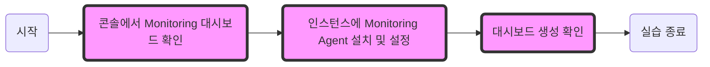

# Monitoring 실습

콘솔에서 Monitoring 대시보드 환경에 대해서 살펴봅니다. 대시보드 활용을 위해 Bastion서버 VM에 Monitoring Agent를 설치하고 설정합니다. 콘솔에서 대시보드가 생성되었는지 확인해보는 실습을 진행합니다.


## 1. 콘솔에서 Monitoring 대시보드 확인


1. 카카오 클라우드 콘솔 > 전체 서비스 > Monitoring 접속
2. Beyond Compute System 클릭
    - 초기화면은 아무것도 보이지 않음

## 2. 인스턴스에 Monitoring Agent 설치 및 설정


1. IAM 실습에서 만들었던 사용자 엑세스 키 ID와 사용자 엑세스 보안 키 준비
2. 카카오 클라우드 콘솔 > 전체 서비스 > Virtual Machine 접속
3. 터미널 명령어 입력
    - Bastion VM에 접속

    #### **lab12-2-3-1**
    ```bash
    cd {keyPair.pem 다운로드 위치}
    ```
    - **Note**: "{keyPair.pem 다운로드 위치}" 부분을 keyPair.pem의 디렉터리 위치로 교체

    #### **lab12-2-3-2**
    ```bash 
    ssh -i keyPair.pem centos@{Bastion의 public IP}
    ```

4. Monitoring Agent 패키지 설치 - 터미널 명령어 입력

    #### **lab12-2-4**
    ```bash
    sudo yum -y localinstall https://objectstorage.kr-central-2.kakaoi.io/v1/52867b7dc99d45fb808b5bc874cb5b79/kic-monitoring-agent/package/kic_monitor_agent-0.9.5.x86_64.rpm
    ```
5. 모니터링 대시보드 생성을 위한 설정 - 터미널 명령어 입력
    - **note**: {사용자 액세스 키 ID} 값을 준비한 실제 액세스 키 ID로 수정
    - **note**: {사용자 액세스 보안 키} 값을 준비한 실제 액세스 보안 키로 수정

    #### **lab12-2-5**
    ```bash
    sudo tee /etc/default/kic_monitor_agent <<EOF
    C_LOG_FILE_PATH="/var/www/html/VMlog"
    KIC_MONITOR_ENDPOINT_URL="https://monitoring.kr-central-2.kakaoi.io"
    KIC_MONITOR_AGENT_AUTH_APPLICATION_CREDENTIAL_ID="{사용자 액세스 키 ID}"
    KIC_MONITOR_AGENT_AUTH_APPLICATION_CREDENTIAL_SECRET="{사용자 액세스 보안 키}"
    ## 호스트가 직접 Public 망에 접속하지 못할 경우, HTTP Proxy 서버를 지정할 수 있습니다.
    # HTTP_PROXY=http://proxy
    # HTTPS_PROXY=https://proxy
    # NO_PROXY=169.254.169.254
    EOF
    ```
6. 설정 변경이 적용되었는지 출력하여 확인 - 터미널 명령어 입력

    #### **lab12-2-6**
    ```bash
    sudo cat -n /etc/default/kic_monitor_agent
    ```
7. 에이전트 수동 시작 - 터미널 명령어 입력
    - enable로 설정하면, 컴퓨터 부팅 시 에이전트 자동 시작
    - 에이전트 실행 확인

    #### **lab12-2-7**
    ```bash
    sudo systemctl restart kic_monitor_agent 
    sudo systemctl enable kic_monitor_agent 
    sudo journalctl -u kic_monitor_agent -f
    ```

## 3. 대시보드 생성 확인


1. 카카오 클라우드 콘솔 > 전체 서비스 > Monitoring 접속
2. Beyond Compute System 클릭
3. 좌측 상단 네모 박스 클릭 > bastion VM 선택
4. 대시보드가 생성된 것을 확인
