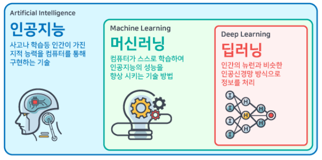
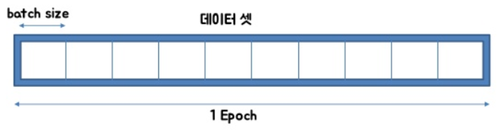

# 인공지능(AI, Artificial Intelligence)이란?

- 컴퓨터 시스템이 인간의 지능을 모방하여 학습, 추론, 문제 해결, 인식, 언어 이해 등의 작업을 수행할 수 있도록 하는 기술

# 인공지능, 머신러닝, 딥러닝의 관계

- 인공지능: 사람의 지능을 모방해서 복잡한 일을 할 수 있는 기계를 만드는 것
- 머신러닝: 인공지능을 구현하는 여러 가지 방법 중에 하나이며, 말 그대로 기계를 학습시키는 개념
- 딥러닝: 인간의 뇌를 모방하여 뉴런을 구성하고 뉴런과 뉴런을 연결(**인공신경망(Artificial Neural Networks)**)해 수학적으로 모델링한 것이며 복잡한 학습을 할 수 있음.
    
    
    

# 머신러닝(ML, Machine Learning)이란?

- 우리말로? 기계 학습
- 기계를 학습시켜서 어떤 결정을 내리거나 예측하도록 함
- 머신러닝의 예
    - 스팸 이메일 필터링: 머신러닝 알고리즘이 이메일이 스팸인지 아닌지를 자동으로 분류
    - 제품 추천 시스템: 사용자의 과거 행동과 선호도 데이터를 학습하여 어떤 제품을 추천
    - 의료 진단: 환자의 의료 기록, 증상, 검사 결과를 학습하여 특정 질병의 가능성을 예측
    

# 프로그래밍 VS 머신러닝

### 프로그래밍 → 프로그램을 만든다.

- 입력: 데이터, 알고리즘(규칙)
- 출력: 원하는 결과(정답)
- 예) 요리사가 레시피(알고리즘)를 미리 정해놓고, 그 레시피에 따라 특정 재료(데이터)를 사용해 완성된 요리(원하는 결과)를 만드는 과정

### 머신러닝 → 모델을 만든다.

- 입력: 데이터, 원하는 결과(정답)
- 출력: 최적의 알고리즘(규칙)
- 예)  요리사에게 다양한 재료(데이터)를 제공하고, 완성된 요리(정답)를 보여주면서 요리사가 최적의 요리법(알고리즘)을 찾을 수있도록 만드는 과정

# 머신러닝에서는’데이터’를 ‘학습’하여 ‘모델’을 만든다.

### 데이터란?

- 학습에 필요한 정보나 사례로 머신러닝 모델이 학습에 필요한 기초 자료
- 일반적으로 입력 데이터(특성, feature)와 이에 대응하는 목표 값(레이블/정답, target)으로 구성
    - 예) 주택 가격을 예측하기 위한 데이터의 경우
        - 입력 데이터: 주택의 크기, 위치, 방의 개수 등
        - 출력 데이터: 실제 주택 가격
    - 입력 데이터: 특성 = 피쳐(feature) = 속성
    - 출력 데이터: 목표 값 = 타깃(target) = 클래스(class) = 레이블/라벨(label) = 정답
- 학습 전에 데이터들(글자, 사진, 영상 등)은 미리 컴퓨터가 이해할 수 있는 형태로 준비

### 학습이란?

- 머신러닝 알고리즘이 데이터를 통해 패턴을 찾아내는 과정
- 머신러닝 알고리즘 유형
    
    
    
    - **지도 학습**
        - 정답을 알고 있는 상태에서 학습
        - 데이터에 정답이 라벨링(’레이블’이라는 정답이 있음) 되어 있음
        - 종류
            - 회귀 - 정답이 연속성이 있는 수치인 경우
                - 예) 주택의 크기(평수), 위치, 방 개수 등의 특징을 바탕으로 주택의 **가격**을 예측하는 문제
            - 분류 - 데이터를 구분할 명확한 기준에 의해 레이블 있는 경우
                - 예) 이메일이 스팸인지 아닌지를 분류하는 문제
    - **비지도 학습**
        - 목푯값이 없는 상태, 즉 정답을 모른 채 데이터에서 특성을 뽑아내고 특성이 비슷한 것끼리 나누거나 분류
        - 데이터 사이의 연관성이나 비정상 데이터를 찾을 때 주로 사용
        - 예) 온라인 마켓 고객들을 여러 그룹으로 나누고, 각 그룹의 특징(예: 고액 구매자, 주기적인 구매자, 특정 상품군 선호 고객 등)을 파악하는 문제
    - **강화 학습**
        - 마치 게임처럼 행동에 따라 보상이나 벌칙을 부여하여 자연스럽게 학습하는 방식
        - 실험을 통해 경험을 쌓아가는 과정과 비슷하며, 목표는 장기적인 보상을 극대화
        - 예) 로봇 팔이 물체를 들어 올리거나 특정 작업을 수행하기 위해 수많은 시도를 하면서 어떤 움직임이 보상을 얻는지 학습

### 모델이란?

- 입력 데이터와 출력 결과를 연결하는 역할
- 데이터를 학습한 후, 모델은 새로운 데이터를 넣었을 때 **어떤 결과를 예측할 수 있는지** 알려준다. → 함수와 비슷
    - 예) 주택의 크기와 위치 등의 데이터를 입력받아 **주택의 가격**을 예측
- 딥러닝에서는 위에서 설명한 **학습** 과정을 통해 모델이 갖는 **가중치**와 **편향** 같은 수학적 값을 조정함.

### 딥러닝이란?

- 머신러닝의 일종으로, **인공 신경망(Artificial Neural Networks)** 을 사용하는 방식
- 인공 신경망이란?
    - 사람의 뇌에서 영감을 받은 구조로, 여러 개의 층으로 이루어진 복잡한 네트워크를 사용해 데이터를 학습
        
        
        
    - 인공 신경망의 구성
        
        
        
        - 입력층(Input Layer): 모델이 데이터를 처음 받아들이는 부분
        - 은닉층(Hidden Layer): 입력층과 출력층 사이에 위치하며, 데이터를 더 복잡하게 변환하고 중간에 숨겨진 패턴을 찾아냄.
        - 출력층(Output Layer): 모델이 최종적으로 결과를 내놓는 부분이며, 모델이 학습한 내용을 바탕으로 예측을 제공
- 퍼셉트론(Perceptron)은 딥러닝의 기본 단위로, 하나의 뉴런(또는 노드)을 나타냄
    - 입력층 1개, 출력층이 1개인 경우: 단층 퍼셉트론 → 복잡한 문제를 해결하는데 한계가 있음
- 다층 퍼셉트론: 여러 퍼셉트론을 연결해 입력층, 은닉층, 출력층으로 3층 이상으로 구성됨
    
    
    
    - = 심층 신경망(Deep Neural Network, DNN)
    - 심층 신경망으로 구성된 모델을 학습시키는 것 = 딥러닝
        - 단, 층이 깊을수록(즉, 은닉층이 많을수록) 딥러닝 모델은 더 복잡한 문제를 해결할 수 있지만, 이와 함께 더 많은 데이터와 계산 자원이 필요하게 됨.

### 심층 신경망 학습의 중요 요소들

- **가중치(Weights)**
    - 가중치는 각 연결이 데이터를 처리할 때 얼마나 중요한지를 말해주는 숫자
    - 주택 가격을 예측할 때 "방의 개수"가 더 중요하면, 그 연결의 가중치가 더 커짐
- **편향(Bias)**
    - 각 뉴런에 더해지는 고정된 숫자로, 뉴런이 결과를 더 유연하게 조정할 수 있도록 도와줌
    - 원점에서 시작하지 않고, 약간 다른 위치에서 출발하도록 조정하는 것과 같음
- **활성화 함수(Activation Function)**
    - 활성화 함수는 뉴런이 받은 데이터를 다음 층으로 어떻게 보낼지(어떻게 변형될지)를 결정하는 역할로 필터 역할을 함
    - 대표적인 활성화 함수
        - ReLU (Rectified Linear Unit): 양수 값은 그대로 통과시키고, 음수 값은 0
        - 시그모이드(Sigmoid): 0과 1 사이의 값으로 변환하는 함수
        - 소프트맥스(Softmax): 여러 후보(출력 값) 중에서 각 후보가 선택될 확률을 계산

### 대표적인 머신러닝 모델 프레임워크

- **TensorFlow**: 구글에서 개발한 오픈소스 머신러닝 프레임워크
- **Keras**: 딥러닝 모델을 빠르고 쉽게 구축할 수 있도록 설계된 고수준 API임. 원래 독립된 라이브러리였으나, 현재는 TensorFlow에 통합되어 많이 사용됨. Keras는 TensorFlow 위에서 동작하며, 딥러닝 모델을 쉽게 디자인하고 실험하는 데 유리함.
- **PyTorch**: 페이스북이 개발한 오픈소스 딥러닝 프레임워크로 직관적인 코딩 스타일, 빠른 디버깅, 연구용으로 많이 사용됨.
- **MXNet**: 아파치 재단이 개발한 딥러닝 프레임워크로  여러 언어(C++, Python부터, Matlab, Julia, JAVAScrip, Go, R 등)를 지원함
- **Scikit-learn**: 파이썬 기반의 오픈 소스 라이브러리이며 전통적인 머신러닝 알고리즘(예: 회귀, 분류, 군집화)을 구현하는 데 사용

# 일반적인 머신러닝 과정

### **문제 정의**: 해결하려는 문제를 정의

- 예제 1) 손글씨 숫자를 분류하기
    - 문제 정의: 이미지를 주고 그에 해당하는 숫자를 예측하는 모델을 만드는 것
    - 대표적인 벤치마크 데이터셋인 MNIST (Modified National Institute of Standards and Technology database)가 있음. 손으로 쓴 0부터 9까지의 숫자들로 이루어진 대형 이미지 데이터셋임.
        - [https://ko.wikipedia.org/wiki/MNIST_데이터베이스](https://ko.wikipedia.org/wiki/MNIST_%EB%8D%B0%EC%9D%B4%ED%84%B0%EB%B2%A0%EC%9D%B4%EC%8A%A4)
- 예제 2) 의류 이미지를 분류하기
    - 문제 정의: 의류 이미지를 주고 해당 이미지가 어떤 종류의 의류인지(예: 티셔츠, 신발 등) 예측하는 모델을 만드는 것
    - 대표적인 벤치마크 데이터셋으로는 **Fashion MNIST (FMNIST)**가 있음. 이는 기존 MNIST의 대안으로, 패션 제품 이미지를 분류하기 위한 대형 이미지 데이터셋으로 사용됨. FMNIST는 10개의 서로 다른 의류 카테고리(티셔츠, 바지, 스웨터 등)로 이루어진 28x28 크기의 회색조 이미지로 구성됨.
        - [Fashion MNIST 데이터셋 정보](https://github.com/zalandoresearch/fashion-mnist)
- 예제 3) 다양한 객체를 분류하기
    - 문제 정의: 다양한 객체 이미지를 주고 해당 이미지가 어떤 객체를 나타내는지(예: 자동차, 개, 비행기 등) 예측하는 모델을 만드는 것
    - 대표적인 벤치마크 데이터셋으로는 CIFAR-10 (Canadian Institute for Advanced Research)가 있음. 이 데이터셋은 32x32 크기의 컬러 이미지로 구성되어 있으며, 10개의 클래스(비행기, 자동차, 새, 고양이 등)로 분류됨. 주로 컴퓨터 비전 연구에서 객체 분류 문제를 해결하기 위해 사용됨.
        - [CIFAR-10 데이터셋 정보](https://www.cs.toronto.edu/~kriz/cifar.html)
- 예제 4) 뉴욕시 택시 요금을 예측하기
    - 문제 정의: 뉴욕시에서 발생한 택시 승차 및 하차 지점과 관련된 데이터를 바탕으로, 해당 택시 요금을 예측하는 모델을 만드는 것
    - 벤치마크 데이터셋은 **NYC Taxi Fare Dataset**으로, Kaggle의 뉴욕시 택시 요금 예측 경진대회에서 제공된 데이터셋임. 이 데이터셋은 택시의 픽업 및 드롭오프 좌표, 승객 수, 픽업 시간 등 다양한 정보로 구성
        - https://www.kaggle.com/competitions/new-york-city-taxi-fare-prediction/data

### **데이터 수집**

- 데이터 직접 수집(웹 스크래핑, 센서 데이터, 설문조사, 또는 조직 내부 데이터베이스 등)
- 또는 벤치마크 데이터셋 활용

### **데이터 전처리**

- 모델의 성능을 극대화하고 안정성을 확보하기 위한 핵심적인 단계이며 전체 작업의 60~80%를 차지할 만큼 중요함.
- 전처리 기법들
    - 결측 값 처리
        - 결측값 제거: 데이터에서 결측값이 있는 행이나 열을 삭제하는 방법.
        - 결측값 대체: 평균, 중앙값, 최빈값 또는 다른 논리적인 값으로 결측값을 채우는 방법.
    - 이상값 처리
        - 이상값 제거: 이상값을 감지하고 제거하는 방법.
        - 이상값 대체: 이상값을 다른 합리적인 값으로 대체하는 방법.
    - 데이터 스케일링
        - 정규화 (Normalization): 데이터를 0과 1 사이의 범위로 변환
    - 범주형 데이터 인코딩
        - 레이블 인코딩: 범주형 변수를 숫자로 변환하는 방식입니다. 예를 들어, "apple", "banana", "cherry"를 각각 0, 1, 2로 변환.
        - 원-핫 인코딩 (One-Hot Encoding): 범주형 데이터를 이진 변수들로 변환하여 각 카테고리를 독립된 열로 표현합니다.
    - 데이터 분할
        - 훈련 세트와 테스트 세트 분할: 데이터셋을 훈련 세트와 테스트 세트로 나누어 모델이 일반화 성능을 갖도록 만듭니다. 보통 70-30 또는 80-20 비율로 나눕니다.
        - 교차 검증: 데이터를 여러 부분으로 나누어 다양한 훈련과 테스트를 반복하는 방법입니다. 이를 통해 모델의 일반화 성능을 높일 수 있습니다.
    - 데이터 샘플링
        - 오버 샘플링: 데이터의 불균형을 해소하기 위해 적은 클래스의 데이터를 증가시키는 방법.
        - 언더 샘플링: 데이터의 불균형을 해소하기 위해 많은 클래스의 데이터를 줄이는 방법.
    - 피처 셀렉션(Feature Selection) 및 차원 축소
        - 피처 셀렉션: 데이터에서 중요한 특성만을 선택해 모델 성능을 향상시키는 방법
        - 차원 축소: PCA(주성분 분석)나 LDA(선형 판별 분석)와 같은 기법을 사용해 데이터의 차원을 줄여 모델의 효율성을 높임

### **모델 학습 방법 선택 (모델 정의)**

- 모델 레이어 구성
    - 모델은 다양한 **레이어**로 구성됨
        - 레이어들은 모델의 예측 성능을 향상시키기 위해 데이터를 변환하고 처리하는 역할을 수행함
    - **레이어(Layer)**란?
        
        
        
        - 신경망에서 데이터를 처리하는 기본 단위
        - 레이어는 다양한 형태가 있으며, 각 레이어가 수행하는 작업에 따라 모델의 성능과 기능이 달라짐
    - 주요 레이어 종류
        - Dense 레이어 (Fully Connected Layer): 모든 뉴런이 이전 레이어의 모든 뉴런과 연결되는 완전 연결 레이어
        - Convolutional 레이어 (합성곱 레이어): ****이미지 처리 및 컴퓨터 비전에서 주로 사용됩니다. 이미지에서 특징을 추출하는 데 중요한 역할을 하며, 주로 CNN(Convolutional Neural Network)에서 사용됨
        - Recurrent 레이어 (순환 레이어): 시계열 데이터나 자연어 처리와 같은 순서가 중요한 데이터에서 주로 사용함. RNN(Recurrent Neural Network) 계열의 모델에서는 데이터를 순차적으로 처리하고, 이전 단계의 정보를 현재 단계에 전달
        - Dropout 레이어: 과적합(overfitting)을 방지하기 위해 학습 과정에서 무작위로 일부 뉴런을 비활성화하는 레이어
        - Pooling 레이어 (MaxPooling, AveragePooling): 합성곱 레이어의 출력을 다운샘플링하여 데이터의 크기를 줄이는 레이어

### 손실 함수(Loss Function) 선택

- 모델이 예측한 값이 실제 값과 얼마나 다른지 수치적으로 표현할 방법이 필요함
- 손실 함수(Loss Function): 모델이 얼마나 잘 예측하고 있는지를 수치화하여 모델을 평가할 수 있고 모델이 가중치와 편향을 어떻게 수정해야 하는지 방향을 제시
- 손실 함수의 결과가 클수록 모델이 잘못 예측한 것이고, 작을수록 더 정확하게 예측한 것
- 잘 알려져있는 손실 함수
    - 평균 제곱 오차(MSE, Mean Squared Error)
    - 이진 교차 엔트로피(Binary Crossentropy)
    - 범주형 교차 엔트로피(Categorical Crossentropy)
    - Sparse Categorical Crossentropy

### 옵티마이저(Optimizer) 선택

- 옵티마이저: 머신러닝 및 딥러닝 모델의 학습 과정에서 가중치(weight)와 편향(bias)을 업데이트하여 손실 함수를 최소화하는 역할을 수행함
- 잘 알려져 있는 옵티마이저
    - 경사 하강법 (Gradient Descent)
    - Momentum
    - Adam (Adaptive Moment Estimation)
    - RMSprop (Root Mean Square Propagation)

### 모델 평가 지표 선택

- 모델 평가 지표: 머신러닝 또는 딥러닝 모델의 성능을 측정하는 데 사용되는 다양한 수치들이 있으며 모델이 얼마나 정확하게 예측을 수행하는지, 그리고 오차가 얼마나 큰지를 평가함
- 잘 알려져 있는 지표들
    - **정확도 (Accuracy)**: 전체 예측 중에서 맞춘 예측의 비율
        - 예시: 이메일 스팸 필터에서 100개의 이메일 중 90개의 이메일을 정확하게 분류했다면 정확도는 90%
    - **정밀도 (Precision)**: 양성으로 예측한 것들 중에서 실제로 양성인 것의 비율
        - 예시: 스팸 이메일 분류에서 스팸으로 분류한 이메일 중 실제 스팸인 이메일의 비율이 80%라면 정밀도는 80%
    - **재현율 (Recall)**: 실제로 양성인 것들 중에서 모델이 양성으로 정확히 예측한 비율
        - 예시: 실제로 스팸인 이메일 중 90%를 스팸 필터에서 정확히 찾아냈다면 재현율은 90%
    - **F1 스코어 (F1 Score)**: 정밀도와 재현율의 조화 평균

### 하이퍼파라미터 (Hyperparameters)

- 모델 학습을 시작하기 전에 사람이 설정해줘야 하는 값들이며 모델이 데이터를 학습하는 방식에 영향을 미침. 또한, 모델이 좋은 성능을 낼 수 있도록 도와줌.
- **학습률 (Learning Rate)**
    
    
    
    - 모델이 가중치와 편향을 얼마나 빠르게 업데이트할지를 결정하는 값
    - 너무 크면 모델이 학습을 지나치게 빨리 해서 중요한 패턴을 놓칠 수 있고, 너무 작으면 학습 속도가 너무 느려짐
- **배치 크기 (Batch Size) 와 에포크 (Epoch)**
    
    
    
    - **배치 크기 (Batch Size)**: 모델이 한 번에 학습할 때 사용하는 데이터의 개수를 의미
        - 큰 배치 크기를 사용하면 학습 속도가 빨라지지만 메모리를 많이 사용하고, 작은 배치 크기를 사용하면 학습 속도가 느려지지만 더 정밀하게 학습할 수 있음
    - **에포크 (Epoch)**: 전체 데이터셋을 모델이 한 번 학습하는 단위
        - 여러 번 반복해서 데이터셋을 학습할수록 모델이 더 정확한 패턴을 찾을 수 있음

# 머신러닝 학습 이후 결과물

### 학습된 모델

- 주어진 데이터를 통해 가중치(weight), 편향값(bias) 등의 파라미터가 최적화된 상태의 모델
- 학습된 모델은 새로운 데이터에 대해 예측을 수행하는 데 사용됨. 학습 데이터에서 추출한 패턴을 바탕으로 새로운 입력에 대해 결과를 예측함.
- 모델 파일 형식: 일반적으로 `.h5`(Keras나 TensorFlow), `.pkl`(Scikit-learn), `.sav`(Scikit-learn이나 XGBoost) 등으로 저장됨

### 평가 결과

- 평가 결과는 모델의 성능을 측정하고 개선점을 찾는 데 사용됨. 이를 통해 모델이 얼마나 정확하고 효율적인지, 어떤 부분에서 개선이 필요한지 파악할 수 있음.
- 정확도, 정밀도, 재현율, F1 등

### 하이퍼파라미터 값

- 모델의 성능을 극대화하기 위해 특정 하이퍼파라미터(예: 학습률, 배치 크기, 에포크 수, 정규화 계수 등)를 튜닝하여 최적 값을 설정
- 학습률, 에포크 수 등

# 출처

1. https://blogfiles.pstatic.net/MjAyMDA0MDNfMTA2/MDAxNTg1OTExMDQ1NTI5.P17sN8p2a9-VLxBj925pnc5VObM_bjGZXMF9b_dW_zcg.B3qmjqddpLwMzuH02GGhkM79Nxut3pmCGhVe-PGx6dIg.PNG.kjh920411/image.png
2. [https://hangjastar.tistory.com/174](https://hangjastar.tistory.com/174)
3. https://blog.altair.co.kr/72930/
4. https://post.naver.com/viewer/postView.naver?volumeNo=33586648&memberNo=38386150
5. https://hong-zone17.tistory.com/76
6. https://taewan2002.medium.com/convolutional-neural-network-6bbfeaeb886d
7. https://thebook.io/080315/0018/
