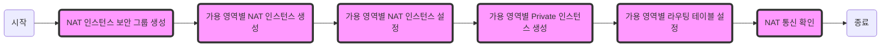

# [Mini Lab] 다중 가용 영역에서 NAT 인스턴스를 이용한 네트워크 구축

Private 서브넷에 위치한 인스턴스가 인터넷과 안전하게 통신할 수 있도록, 각 가용 영역(AZ)마다 NAT 인스턴스를 구성합니다.
한 가용 영역에 장애가 발생해도 다른 가용 영역은 자신의 NAT 인스턴스를 통해 계속 외부와 통신할 수 있도록 하여, 단일 지점 장애(SPOF)를 방지하는 다중 가용 영역 NAT 구성 실습입니다.

> 참고: [카카오클라우드 공식 튜토리얼 - 다중 가용 영역에서 NAT 인스턴스를 이용한 네트워크 구축](https://docs.kakaocloud.com/tutorial/networking-content-delivery/private-subnet)




> **Note**: 시간표상 [Lab4] VM 생성 실습 직후에 진행되는 Mini Lab이라, [Lab03(VPC 생성)](https://github.com/kakaocloud-edu/tutorial/blob/main/EssentialBasicCourse/PracticalTextbook/Lab03.md)에서 만든 `kr-central-2-a`, `kr-central-2-b` 두 개 가용 영역과 각 AZ의 퍼블릭·프라이빗 서브넷이 있는 `vpc_1`, 그리고 [Lab04](https://github.com/kakaocloud-edu/tutorial/blob/main/EssentialBasicCourse/PracticalTextbook/Lab04.md)에서 만든 `bastion` 인스턴스를 그대로 재사용합니다. 새 VPC/서브넷은 만들지 않습니다.

| 가용 영역 | 퍼블릭 서브넷 | 프라이빗 서브넷 |
| --- | --- | --- |
| kr-central-2-a | `vpc_1_public_sn1` | `vpc_1_private_sn1` |
| kr-central-2-b | `vpc_1_public_sn2` | `vpc_1_private_sn2` |

## 1. NAT 인스턴스용 보안 그룹 생성

1. 카카오 클라우드 콘솔 > 전체 서비스 > VPC 접속
2. 보안 그룹 클릭
3. 보안 그룹 생성 버튼 클릭
     - 보안 그룹 이름 : `nat-instance`
     - Inbound
          - 프로토콜: `TCP`, 패킷 출발지: `172.30.0.0/16`, 포트 번호: `80`
          - 프로토콜: `TCP`, 패킷 출발지: `172.30.0.0/16`, 포트 번호: `443`
          - 프로토콜: `TCP`, 패킷 출발지: `{bastion의 Private IP}/32`, 포트 번호: `22`
               - **Note**: "{bastion의 Private IP}" 부분을 bastion 인스턴스의 Private IP 주소로 교체하세요.
     - Outbound
          - 프로토콜: `TCP`, 패킷 목적지: `0.0.0.0/0`, 포트 번호: `80`
          - 프로토콜: `TCP`, 패킷 목적지: `0.0.0.0/0`, 포트 번호: `443`
          - 프로토콜: `UDP`, 패킷 목적지: `169.254.169.253/32`, 포트 번호: `53`
          - 프로토콜: `UDP`, 패킷 목적지: `172.30.0.2/32`, 포트 번호: `53`
4. 생성 버튼 클릭
     - **Note**: 이 보안 그룹은 아래에서 생성할 두 개의 NAT 인스턴스(AZ-a, AZ-b)에 공통으로 사용합니다.

## 2. 가용 영역별 NAT 인스턴스 생성

1. 카카오 클라우드 콘솔 > 전체 서비스 > Virtual Machine 접속
2. 인스턴스 생성 버튼 클릭 후, 아래와 같이 두 개의 가용 영역에 각각 생성

    | 항목 | kr-central-2-a | kr-central-2-b |
    | --- | --- | --- |
    | 이름 | `nat-instance-a` | `nat-instance-b` |
    | Image | `Ubuntu 20.04` | `Ubuntu 20.04` |
    | Instance 타입 | `m2a.large` | `m2a.large` |
    | Volume | `30 GB` | `30 GB` |
    | Key Pair | `keypair` | `keypair` |
    | VPC | `vpc_1` | `vpc_1` |
    | Subnet | `vpc_1_public_sn1` | `vpc_1_public_sn2` |
    | 보안 그룹 | `nat-instance` | `nat-instance` |

    - **Note**: Instance 타입은 NAT 통신(패킷 포워딩)만 처리하면 되므로 `t1i.nano`처럼 작은 타입으로도 충분하지만, 실습 편의상 다른 VM들과 통일해 `m2a.large`로 진행합니다. `m2a.xlarge`를 쓰셔도 동작에는 차이가 없습니다.
3. 생성 버튼 클릭
4. 생성된 `nat-instance-a`, `nat-instance-b` 각각의 우측 메뉴바 > Public IP 연결 클릭
     - `새로운 Public IP를 생성하고 자동으로 할당` 선택
5. 확인 버튼 클릭
     - **Note**: 연결된 Public IP는 각 인스턴스의 네트워크 탭에서 확인할 수 있습니다.

## 3. 가용 영역별 NAT 인스턴스 설정

### 3-1. nat-instance-a

1. 터미널에서 keypair를 다운받아놓은 폴더로 이동 후 SSH 접속
     #### **lab-nat-3-1-1-1**
     ```bash
     cd {keypair.pem 다운로드 위치}
     ```
     #### **lab-nat-3-1-1-2**
     ```bash
     ssh -i keypair.pem ubuntu@{nat-instance-a의 public ip주소}
     ```
     - **Note**: "{nat-instance-a의 public ip주소}" 부분을 복사한 IP 주소로 교체하세요.

2. NAT 통신을 위한 IP 포워딩 및 마스커레이딩 설정 - 터미널 명령어 입력
     - 이 명령어는 사용 가능한 네트워크 인터페이스를 자동으로 식별하고, IP 포워딩을 활성화하며, 선택된 인터페이스에 대한 네트워크 트래픽 마스커레이딩을 자동으로 구성합니다.

     #### **lab-nat-3-1-2**
     ```bash
     sudo apt-get update -y

     LINE=$(grep 'net.ipv4.ip_forward=' /etc/sysctl.conf)
     sudo sed -i "s/${LINE}/net.ipv4.ip_forward=1/" /etc/sysctl.conf
     sudo sysctl -p

     INTERFACE=$(ip link | awk -F: '$0 !~ "lo|vir|wl|^[^0-9]"{print $2;getline}')
     sudo /sbin/iptables -t nat -A POSTROUTING -o ${INTERFACE} -j MASQUERADE
     sudo apt-get install -y iptables-persistent
     ```
     - iptables-persistent 설치 중 규칙 저장 여부를 묻는 창이 뜨면 `Yes`가 선택된 상태에서 Enter 입력

     

     - 스크립트 실행 결과 화면은 아래와 같습니다.

     

### 3-2. nat-instance-b

1. `nat-instance-a`와 동일하게, `nat-instance-b`의 Public IP로 접속하여 위 2번 스크립트를 동일하게 실행

## 4. 패킷 송신 허용 IP 수정

1. 카카오 클라우드 콘솔 > 전체 서비스 > Virtual Machine 접속
2. `nat-instance-a` 인스턴스의 우측 메뉴바 > 패킷 송신 허용 IP 수정 클릭
     - 패킷 송신 허용 IP : `0.0.0.0/0` 추가
       - **Note**: 인스턴스는 기본적으로 자신을 목적지로 하는 트래픽만 수신합니다. NAT 인스턴스는 자신이 출발지/목적지가 아닌 트래픽도 전달해야 하므로, 패킷 송신 허용 IP를 추가해 트래픽을 포워딩할 수 있도록 설정합니다.
3. 수정 버튼 클릭
4. `nat-instance-b`에 대해서도 위 2~3번 과정을 동일하게 수행

## 5. 가용 영역별 Private 인스턴스 생성

1. 카카오 클라우드 콘솔 > 전체 서비스 > VPC 접속 > 보안 그룹 클릭
2. 보안 그룹 생성 버튼 클릭
     - 보안 그룹 이름 : `private-vm`
     - Inbound
          - 프로토콜: `TCP`, 패킷 출발지: `{bastion의 Private IP}/32`, 포트 번호: `22`
               - **Note**: "{bastion의 Private IP}" 부분을 bastion 인스턴스의 Private IP 주소로 교체하세요.
     - Outbound
          - 프로토콜 : `ALL`, 패킷 목적지 : `0.0.0.0/0`
3. 생성 버튼 클릭
     - **Note**: 이 보안 그룹도 AZ-a, AZ-b 두 Private 인스턴스에 공통으로 사용합니다.
4. 카카오 클라우드 콘솔 > 전체 서비스 > Virtual Machine 접속
5. 인스턴스 생성 버튼 클릭 후, 아래와 같이 두 개의 가용 영역에 각각 생성

    | 항목 | kr-central-2-a | kr-central-2-b |
    | --- | --- | --- |
    | 이름 | `private-vm-a` | `private-vm-b` |
    | Image | `Ubuntu 20.04` | `Ubuntu 20.04` |
    | Instance 타입 | `m2a.large` | `m2a.large` |
    | Volume | `30 GB` | `30 GB` |
    | Key Pair | `keypair` | `keypair` |
    | VPC | `vpc_1` | `vpc_1` |
    | Subnet | `vpc_1_private_sn1` | `vpc_1_private_sn2` |
    | 보안 그룹 | `private-vm` | `private-vm` |

6. 생성 버튼 클릭

## 6. 가용 영역별 라우팅 테이블 생성 및 설정

1. 카카오 클라우드 콘솔 > 전체 서비스 > VPC 접속 > 라우팅 테이블 탭 클릭
2. 라우팅 테이블 생성 버튼 클릭 후, 아래와 같이 두 개의 가용 영역에 각각 생성

    | 항목 | kr-central-2-a | kr-central-2-b |
    | --- | --- | --- |
    | 라우팅 테이블 이름 | `private-nat-rt-a` | `private-nat-rt-b` |
    | VPC | `vpc_1` | `vpc_1` |

3. 생성된 `private-nat-rt-a` 클릭 > 라우팅 탭 클릭
4. 라우팅 추가 버튼 클릭
     - 대상 유형 : `인스턴스`
     - 대상 인스턴스 : `nat-instance-a`
     - 목적지 : `0.0.0.0/0`
5. 추가 버튼 클릭
6. 연결 수정 버튼 클릭
     - `vpc_1_private_sn1` 서브넷 연결
7. 연결 버튼 클릭
8. `private-nat-rt-b`에 대해서도 위 3~7번 과정을 동일하게 수행
     - 대상 인스턴스 : `nat-instance-b`
     - 연결할 서브넷 : `vpc_1_private_sn2`

## 7. NAT 통신 확인

1. 카카오 클라우드 콘솔 > 전체 서비스 > Virtual Machine 접속
2. Bastion과 `private-vm-a`, `private-vm-b`의 Private IP, `nat-instance-a`, `nat-instance-b`의 Public IP 확인 및 복사
3. 터미널 명령어 입력
     - keypair를 다운받아놓은 폴더로 이동
     - Bastion을 경유하여 `private-vm-a`에 접속

     #### **lab-nat-7-3-1**
     ```bash
     cd {keypair.pem 다운로드 위치}
     ```
     #### **lab-nat-7-3-2**
     ```bash
     ssh -i "keypair.pem" -o ProxyCommand="ssh -W %h:%p ubuntu@{bastion의 public IP} -i keypair.pem" ubuntu@{private-vm-a의 private IP}
     ```
     - **Note**: "{bastion의 public IP}", "{private-vm-a의 private IP}" 부분을 복사한 IP 주소로 교체하세요.

4. `private-vm-a`에서 외부로 나가는 퍼블릭 IP 확인
     #### **lab-nat-7-4**
     ```bash
     curl https://ifconfig.me/ip
     ```
5. 위 결과로 나온 IP 주소가 `nat-instance-a`의 Public IP와 일치하는지 확인
6. 같은 방법으로 Bastion을 경유하여 `private-vm-b`에 접속 후 동일하게 확인
     - `curl https://ifconfig.me/ip` 결과가 `nat-instance-b`의 Public IP와 일치하는지 확인
     - 두 결과가 각각 일치한다면, 가용 영역별로 Private 서브넷의 트래픽이 해당 AZ의 NAT 인스턴스를 거쳐 정상적으로 인터넷과 통신하고 있다는 뜻입니다.
